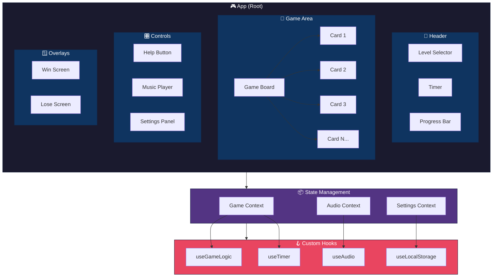
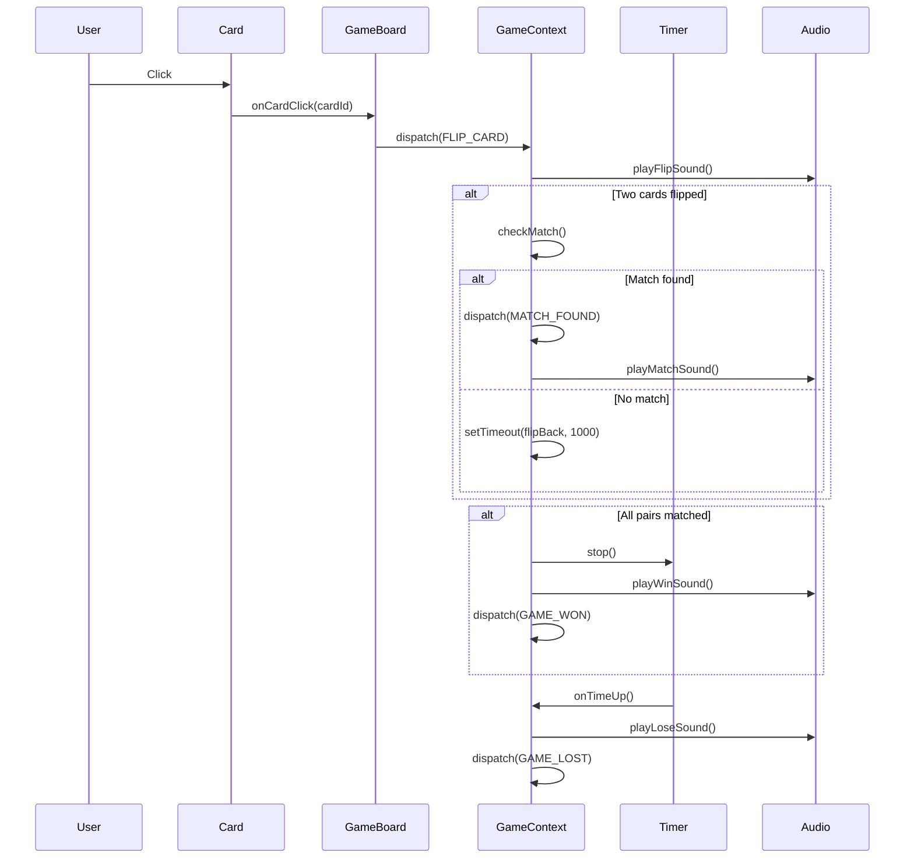

# 📊 Component Diagram

## Mermaid Component Diagram



---

## Component Responsibility Matrix

| Component | Props | State | Side Effects | Renders |
|-----------|-------|-------|--------------|---------|
| **App** | None | `gameStatus`, `level` | Initialize game | All children |
| **Header** | `level`, `timer`, `progress` | None | None | Title, timer, progress |
| **GameBoard** | `cards`, `onCardClick` | `flippedCards` | Check matches | Grid of cards |
| **Card** | `card`, `onClick`, `isFlipped` | None | Animation | Single card |
| **Timer** | `initialTime`, `onTimeUp` | `timeLeft` | Countdown interval | Time display |
| **ProgressBar** | `matched`, `total` | None | None | Progress indicator |
| **HelpButton** | `hintsLeft`, `onUseHint` | None | Audio | Hint button |
| **WinScreen** | `stats`, `onPlayAgain` | None | Audio | Victory overlay |
| **LoseScreen** | `stats`, `onTryAgain` | None | Audio | Defeat overlay |
| **MusicPlayer** | None | `isPlaying`, `volume` | Audio playback | Audio controls |
| **SettingsPanel** | `settings`, `onChange` | `isOpen` | None | Settings form |
| **LevelSelector** | `currentLevel`, `onSelect` | `isOpen` | None | Level dropdown |

---

## Component Communication Diagram

```
┌─────────────────────────────────────────────────────────────────────────────┐
│                                   APP                                       │
│  ┌───────────────────────────────────────────────────────────────────────┐  │
│  │                              HEADER                                   │  │
│  │                                                                       │  │
│  │   ┌─────────────┐    ┌─────────────┐    ┌─────────────────────────┐  │  │
│  │   │   Level     │    │    Timer    │    │      ProgressBar        │  │  │
│  │   │  Selector   │    │             │    │                         │  │  │
│  │   │             │    │  timeLeft   │    │   matched / total       │  │  │
│  │   │ onLevelChange    │  onTimeUp() │    │                         │  │  │
│  │   └─────────────┘    └─────────────┘    └─────────────────────────┘  │  │
│  │         │                   │                       ▲                │  │
│  │         │                   │                       │                │  │
│  └─────────│───────────────────│───────────────────────│────────────────┘  │
│            │                   │                       │                    │
│            ▼                   ▼                       │                    │
│  ┌───────────────────────────────────────────────────────────────────────┐  │
│  │                           GAME CONTEXT                                │  │
│  │                                                                       │  │
│  │   cards[] ─────────────────────────────────────────────┐              │  │
│  │   flippedCards[] ───────────────────────────┐          │              │  │
│  │   matchedPairs ─────────────────────────────│──────────│──────────────│──│
│  │   gameStatus ───────────────────────────────│──────────│──────────────│  │
│  │   hintsLeft ────────────────────────────────│──────────│──────────────│  │
│  │                                             │          │              │  │
│  └─────────────────────────────────────────────│──────────│──────────────┘  │
│                                                │          │                  │
│            ┌───────────────────────────────────┘          │                  │
│            │                                              │                  │
│            ▼                                              ▼                  │
│  ┌───────────────────────────────────────────────────────────────────────┐  │
│  │                            GAMEBOARD                                  │  │
│  │                                                                       │  │
│  │   ┌─────────┐ ┌─────────┐ ┌─────────┐ ┌─────────┐ ┌─────────┐        │  │
│  │   │  CARD   │ │  CARD   │ │  CARD   │ │  CARD   │ │  CARD   │ ...    │  │
│  │   │         │ │         │ │         │ │         │ │         │        │  │
│  │   │ onClick │ │ onClick │ │ onClick │ │ onClick │ │ onClick │        │  │
│  │   └────┬────┘ └────┬────┘ └────┬────┘ └────┬────┘ └────┬────┘        │  │
│  │        │           │           │           │           │              │  │
│  │        └───────────┴───────────┴───────────┴───────────┘              │  │
│  │                                │                                      │  │
│  └────────────────────────────────│──────────────────────────────────────┘  │
│                                   │                                          │
│                                   ▼                                          │
│                          ┌───────────────┐                                   │
│                          │  GAME LOGIC   │                                   │
│                          │               │                                   │
│                          │  flipCard()   │                                   │
│                          │  checkMatch() │                                   │
│                          │  updateState()│                                   │
│                          └───────────────┘                                   │
│                                                                              │
│  ┌─────────────┐  ┌─────────────┐         ┌──────────────────────────────┐  │
│  │ HELP BUTTON │  │MUSIC PLAYER │         │         OVERLAYS             │  │
│  │             │  │             │         │                              │  │
│  │  hintsLeft  │  │  isPlaying  │         │  ┌──────────┐ ┌──────────┐   │  │
│  │  onUseHint()│  │  volume     │         │  │   WIN    │ │   LOSE   │   │  │
│  │             │  │  toggle()   │         │  │  SCREEN  │ │  SCREEN  │   │  │
│  └─────────────┘  └─────────────┘         │  └──────────┘ └──────────┘   │  │
│                                           └──────────────────────────────┘  │
│                                                                              │
└──────────────────────────────────────────────────────────────────────────────┘
```

---

## Component Interfaces (Props)

### Card Component
```javascript
{
  card: {
    id: string,
    emoji: string,
    isFlipped: boolean,
    isMatched: boolean
  },
  onClick: (cardId: string) => void,
  disabled: boolean
}
```

### Timer Component
```javascript
{
  initialTime: number,      // in seconds
  isRunning: boolean,
  onTimeUp: () => void,
  onTick: (timeLeft: number) => void
}
```

### ProgressBar Component
```javascript
{
  matchedPairs: number,
  totalPairs: number,
  showPercentage: boolean
}
```

### WinScreen Component
```javascript
{
  stats: {
    timeElapsed: number,
    hintsUsed: number,
    level: string,
    score: number
  },
  onPlayAgain: () => void,
  onChangeLevel: () => void
}
```

### LoseScreen Component
```javascript
{
  stats: {
    matchedPairs: number,
    totalPairs: number,
    level: string
  },
  onTryAgain: () => void,
  onChangeLevel: () => void
}
```

---

## Event Flow Diagram


