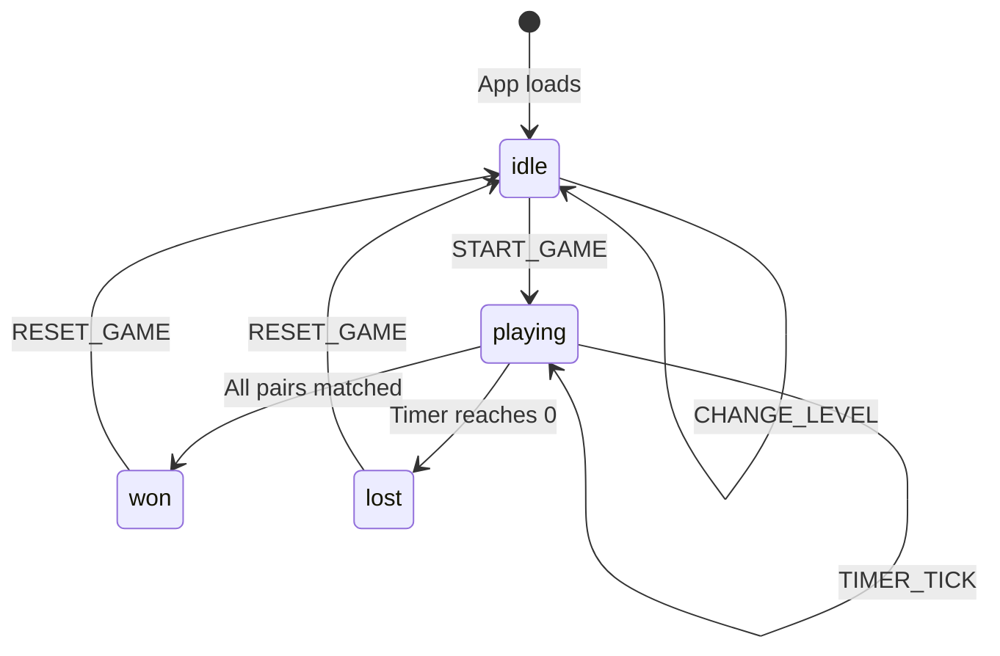
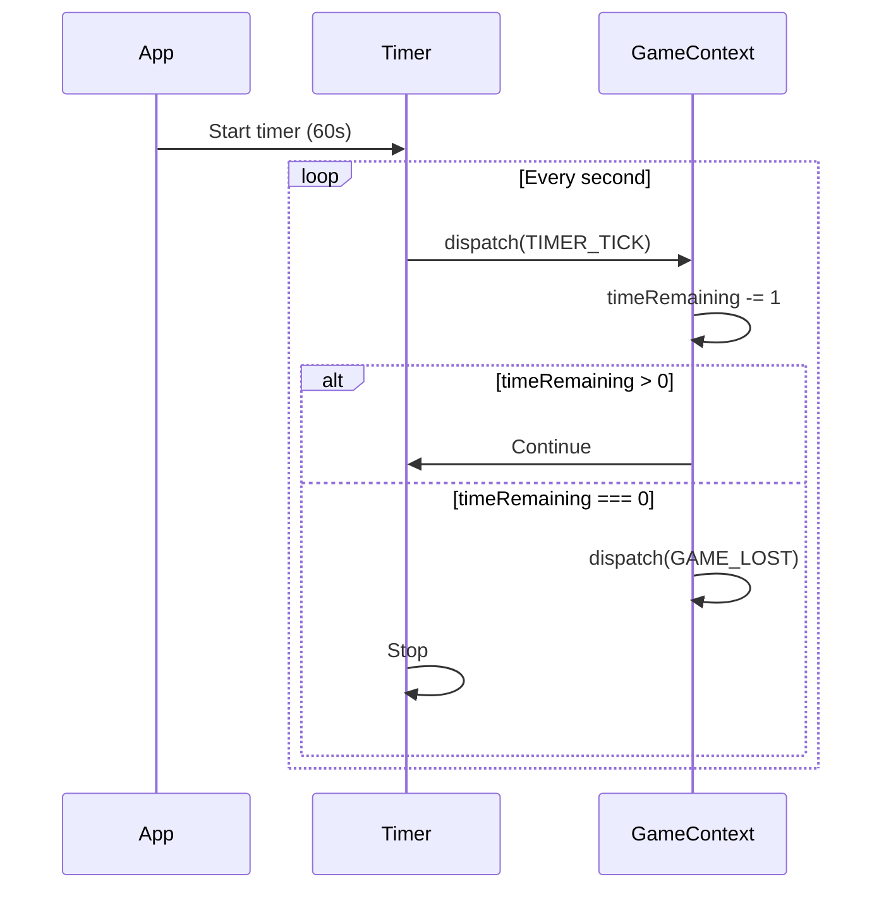

# 🔄 State Management Flow

## State Overview

The application uses a combination of **React Context API** and **useReducer** for state management, organized into three main contexts:

```
┌────────────────────────────────────────────────────────────────────┐
│                         STATE ARCHITECTURE                         │
├────────────────────────────────────────────────────────────────────┤
│                                                                    │
│   ┌──────────────────────────────────────────────────────────┐    │
│   │                    GameContext                            │    │
│   │  ┌─────────────────────────────────────────────────────┐ │    │
│   │  │                    State                            │ │    │
│   │  │  • cards: Card[]                                    │ │    │
│   │  │  • flippedCards: string[]                           │ │    │
│   │  │  • matchedPairs: number                             │ │    │
│   │  │  • currentLevel: Level                              │ │    │
│   │  │  • gameStatus: 'idle'|'playing'|'won'|'lost'        │ │    │
│   │  │  • hintsLeft: number                                │ │    │
│   │  │  • timeRemaining: number                            │ │    │
│   │  └─────────────────────────────────────────────────────┘ │    │
│   │  ┌─────────────────────────────────────────────────────┐ │    │
│   │  │                   Actions                           │ │    │
│   │  │  • START_GAME                                       │ │    │
│   │  │  • FLIP_CARD                                        │ │    │
│   │  │  • CHECK_MATCH                                      │ │    │
│   │  │  • MATCH_FOUND                                      │ │    │
│   │  │  • NO_MATCH                                         │ │    │
│   │  │  • USE_HINT                                         │ │    │
│   │  │  • TIMER_TICK                                       │ │    │
│   │  │  • GAME_WON                                         │ │    │
│   │  │  • GAME_LOST                                        │ │    │
│   │  │  • RESET_GAME                                       │ │    │
│   │  │  • CHANGE_LEVEL                                     │ │    │
│   │  └─────────────────────────────────────────────────────┘ │    │
│   └──────────────────────────────────────────────────────────┘    │
│                                                                    │
│   ┌──────────────────────────────────────────────────────────┐    │
│   │                    AudioContext                           │    │
│   │  • musicEnabled: boolean                                  │    │
│   │  • soundEnabled: boolean                                  │    │
│   │  • volume: number (0-1)                                   │    │
│   │  • currentTrack: string                                   │    │
│   └──────────────────────────────────────────────────────────┘    │
│                                                                    │
│   ┌──────────────────────────────────────────────────────────┐    │
│   │                   SettingsContext                         │    │
│   │  • theme: 'light' | 'dark'                                │    │
│   │  • animations: boolean                                    │    │
│   │  • haptics: boolean                                       │    │
│   └──────────────────────────────────────────────────────────┘    │
│                                                                    │
└────────────────────────────────────────────────────────────────────┘
```

---

## Game State Machine



---

## State Flow Diagram

```
                                    User Action
                                        │
                                        ▼
┌──────────────────────────────────────────────────────────────────────────────┐
│                              ACTION DISPATCH                                  │
│                                                                              │
│   dispatch({ type: 'FLIP_CARD', payload: { cardId: 'card-1' } })            │
│                                                                              │
└──────────────────────────────────────────────────────────────────────────────┘
                                        │
                                        ▼
┌──────────────────────────────────────────────────────────────────────────────┐
│                               GAME REDUCER                                    │
│                                                                              │
│   switch (action.type) {                                                     │
│     case 'FLIP_CARD':                                                        │
│       // 1. Check if card can be flipped                                     │
│       // 2. Update flippedCards array                                        │
│       // 3. Return new state                                                 │
│       return {                                                               │
│         ...state,                                                            │
│         flippedCards: [...state.flippedCards, action.payload.cardId],       │
│         cards: state.cards.map(card =>                                       │
│           card.id === action.payload.cardId                                  │
│             ? { ...card, isFlipped: true }                                   │
│             : card                                                           │
│         )                                                                    │
│       };                                                                     │
│   }                                                                          │
│                                                                              │
└──────────────────────────────────────────────────────────────────────────────┘
                                        │
                                        ▼
┌──────────────────────────────────────────────────────────────────────────────┐
│                            STATE UPDATE                                       │
│                                                                              │
│   New State:                                                                 │
│   {                                                                          │
│     cards: [...updated cards...],                                            │
│     flippedCards: ['card-1'],                                                │
│     matchedPairs: 0,                                                         │
│     gameStatus: 'playing',                                                   │
│     ...                                                                      │
│   }                                                                          │
│                                                                              │
└──────────────────────────────────────────────────────────────────────────────┘
                                        │
                                        ▼
┌──────────────────────────────────────────────────────────────────────────────┐
│                              RE-RENDER                                        │
│                                                                              │
│   Components subscribed to GameContext re-render with new state              │
│                                                                              │
│   • GameBoard receives updated cards[]                                       │
│   • Card component shows flipped state                                       │
│   • ProgressBar remains unchanged                                            │
│                                                                              │
└──────────────────────────────────────────────────────────────────────────────┘
```

---

## Action Types Reference

### Game Actions

```javascript
// Start a new game
{ type: 'START_GAME', payload: { level: 'easy' } }

// Flip a card
{ type: 'FLIP_CARD', payload: { cardId: 'card-1' } }

// Match found between two cards
{ type: 'MATCH_FOUND', payload: { card1Id: 'card-1', card2Id: 'card-2' } }

// No match - flip cards back
{ type: 'NO_MATCH' }

// Use a hint
{ type: 'USE_HINT' }

// Timer tick (called every second)
{ type: 'TIMER_TICK' }

// Game won
{ type: 'GAME_WON', payload: { timeElapsed: 45, hintsUsed: 1 } }

// Game lost (time ran out)
{ type: 'GAME_LOST' }

// Reset the game
{ type: 'RESET_GAME' }

// Change difficulty level
{ type: 'CHANGE_LEVEL', payload: { level: 'medium' } }
```

### Audio Actions

```javascript
// Toggle background music
{ type: 'TOGGLE_MUSIC' }

// Toggle sound effects
{ type: 'TOGGLE_SOUND' }

// Set volume
{ type: 'SET_VOLUME', payload: { volume: 0.5 } }

// Play a sound effect
{ type: 'PLAY_SOUND', payload: { sound: 'flip' } }
```

---

## Card Flip State Flow

```
┌─────────────────────────────────────────────────────────────────────────────┐
│                           CARD FLIP FLOW                                    │
└─────────────────────────────────────────────────────────────────────────────┘

Initial State:
flippedCards: []
Card 1: { isFlipped: false }
Card 2: { isFlipped: false }

                    User clicks Card 1
                           │
                           ▼
                    ┌──────────────┐
                    │ FLIP_CARD    │
                    │ cardId: 1    │
                    └──────────────┘
                           │
                           ▼
State After First Click:
flippedCards: ['card-1']
Card 1: { isFlipped: true }  ← Now showing emoji
Card 2: { isFlipped: false }

                    User clicks Card 2
                           │
                           ▼
                    ┌──────────────┐
                    │ FLIP_CARD    │
                    │ cardId: 2    │
                    └──────────────┘
                           │
                           ▼
State After Second Click:
flippedCards: ['card-1', 'card-2']
Card 1: { isFlipped: true }
Card 2: { isFlipped: true }  ← Now showing emoji

                           │
                           ▼
                 ┌─────────────────────┐
                 │   flippedCards.     │
                 │   length === 2      │
                 │   CHECK_MATCH       │
                 └─────────────────────┘
                           │
             ┌─────────────┴─────────────┐
             │                           │
    ┌────────▼────────┐        ┌─────────▼────────┐
    │   MATCH FOUND   │        │    NO MATCH      │
    │                 │        │                  │
    │ Card1.emoji === │        │ Card1.emoji !==  │
    │ Card2.emoji     │        │ Card2.emoji      │
    └────────┬────────┘        └─────────┬────────┘
             │                           │
             ▼                           ▼
    flippedCards: []            setTimeout(1000ms)
    Card 1: { isMatched: true }         │
    Card 2: { isMatched: true }         ▼
    matchedPairs: +1             NO_MATCH action
                                 flippedCards: []
                                 Card 1: { isFlipped: false }
                                 Card 2: { isFlipped: false }
```

---

## Timer State Flow



---

## Hint System State Flow

```
┌─────────────────────────────────────────────────────────────────┐
│                      HINT FLOW                                  │
└─────────────────────────────────────────────────────────────────┘

Initial: hintsLeft: 3

        User clicks Help Button
                 │
                 ▼
        ┌────────────────┐
        │  hintsLeft > 0 │
        │       ?        │
        └────────────────┘
                 │
       ┌─────────┴──────────┐
       │                    │
       ▼                    ▼
    YES                    NO
       │               (Button disabled)
       │
       ▼
┌─────────────────────────────────────┐
│           USE_HINT Action           │
│                                     │
│  1. Find unmatched pair             │
│  2. Temporarily reveal both cards   │
│  3. setTimeout to hide (2 seconds)  │
│  4. Decrement hintsLeft             │
│                                     │
└─────────────────────────────────────┘
       │
       ▼
New State:
hintsLeft: 2
revealedHintCards: ['card-5', 'card-8']

       After 2 seconds
            │
            ▼
revealedHintCards: []
Cards return to face-down state
```

---

## localStorage Persistence

```javascript
// Data persisted to localStorage
{
  "memoryGame_settings": {
    "musicEnabled": true,
    "soundEnabled": true,
    "volume": 0.7,
    "theme": "dark"
  },
  "memoryGame_highScores": {
    "easy": { "bestTime": 42, "date": "2024-01-14" },
    "medium": { "bestTime": 78, "date": "2024-01-13" },
    "hard": { "bestTime": 110, "date": "2024-01-12" }
  }
}
```

**Sync Flow:**
```
State Change → useEffect → localStorage.setItem()

App Load → useState(initialValue) → localStorage.getItem() || defaultValue
```
